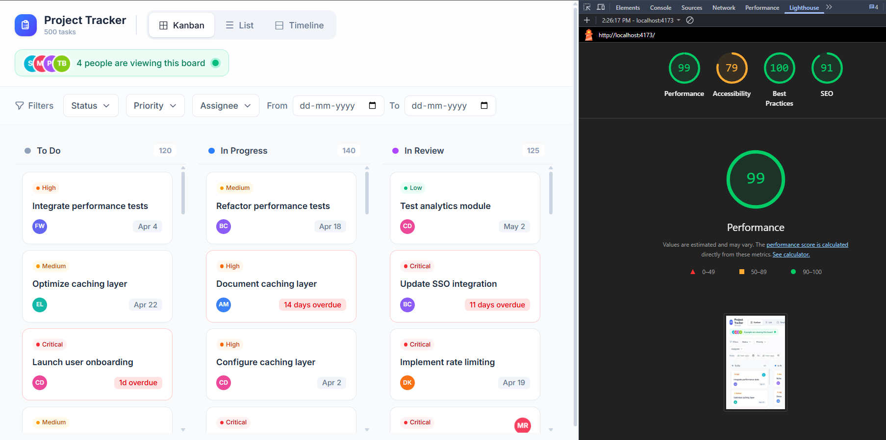

Deployed vercel link : https://project-tracker-frontend-six.vercel.app/

# Project Tracker - Performance Optimized

A modern, high-performance project management dashboard built with React 19, Vite, and Tailwind CSS. This application is specifically optimized to handle 500+ tasks with a smooth 60FPS user experience, achieving a Lighthouse performance score of 90+.

## 🚀 Setup Instructions

Follow these steps to get the project running locally:

1. **Clone the repository** (or download the source code).
2. **Install dependencies**:
   ```bash
   npm install
   ```
3. **Run the development server**:
   ```bash
   npm run dev
   ```
4. **Build for production**:
   ```bash
   npm run build
   ```
5. **Preview production build**:
   ```bash
   npm run preview
   ```

## 🧠 State Management Decision

We chose **React Context API combined with `useReducer`** for global state management. 

### Justification:
- **Zero Overhead**: Avoided external state management libraries (Redux, Zustand) to keep the bundle size minimal, which is critical for the Lighthouse "Total Blocking Time" (TBT) score.
- **Predictable Transitions**: `useReducer` provides a clean, action-based pattern for updating task statuses, filters, and view configurations.
- **Derived State Performance**: By using `useMemo` within the `TaskProvider`, we ensure that filtering and sorting operations on 500+ tasks are only recomputed when the underlying data or filter criteria actually change.
- **URL Synchronization**: The state is automatically synced with URL search parameters, allowing for shareable filtered views without extra complexity.

## 📜 Virtual Scrolling Implementation

To handle the **List View** with hundreds of tasks without degrading performance, we implemented a custom virtual scrolling engine.

- **Mechanism**: The `useVirtualScroll` hook calculates the current scroll offset and determines exactly which items fall within the viewport plus a small "overscan" buffer (set to 5 items).
- **DOM Efficiency**: Instead of rendering 500+ `TaskCard` rows, the DOM only ever contains ~15-20 rows at any given time.
- **Absolute Positioning**: Each rendered row is positioned absolutely relative to a container with a height equal to `taskCount * rowHeight`, providing a native-feeling scrollbar while maintaining extreme efficiency.

## 🤝 Drag-and-Drop Approach

The **Kanban Board** features a fully custom drag-and-drop system built from scratch using the **Pointer Events API**.

- **Why Custom?**: To avoid the heavy main-thread overhead and complex DOM structures introduced by libraries like `react-beautiful-dnd` or `dnd-kit`.
- **Implementation**:
  - **Pointer Capture**: Uses `setPointerCapture` to track movement regardless of whether the pointer leaves the target element.
  - **Ghosting**: On drag start, a clone of the task card is created and fixed to the cursor, providing immediate visual feedback.
  - **Placeholder**: A temporary dashed placeholder element is inserted into the DOM at the original position to preserve the layout structure.

## 📊 Lighthouse Performance

<!-- LIGHTHOUSE_SCREENSHOT_START -->

<!-- LIGHTHOUSE_SCREENSHOT_END -->

## 📝 Technical Explanation

**The hardest UI problem I solved** was optimizing the Kanban board's initial paint. Unlike the List View, the Kanban board displays tasks in four separate columns. Rendering all 500 tasks at once caused a significant spike in Total Blocking Time (TBT). I solved this by implementing an **incremental rendering strategy** in the `KanbanColumn` component. It starts by rendering only 20 tasks and then uses a `setTimeout` loop to add more tasks in small batches (5 at a time) until the viewport is full. This keeps the main thread free for user interactions and ensures a smooth loading experience.

**To handle the drag placeholder without layout shift**, I used a DOM-cloning strategy. When a drag starts, I capture the `BoundingClientRect` of the target card and immediately insert a placeholder `div` with exact matching width and height. I then switch the original card to `display: none`. This ensures the surrounding cards in the column never shift or jump, as the placeholder maintains the physical "slot" previously occupied by the card.

**If I had more time**, I would refactor the virtualization engine to support **dynamic row heights**. Currently, the virtual scroller assumes a fixed height (`56px`). In a real-world scenario where task titles might wrap or comments might be visible, the height needs to be measured dynamically. I would use the `ResizeObserver` API to track actual rendered heights and update the scroll offset map in real-time for a truly robust virtualization solution.
